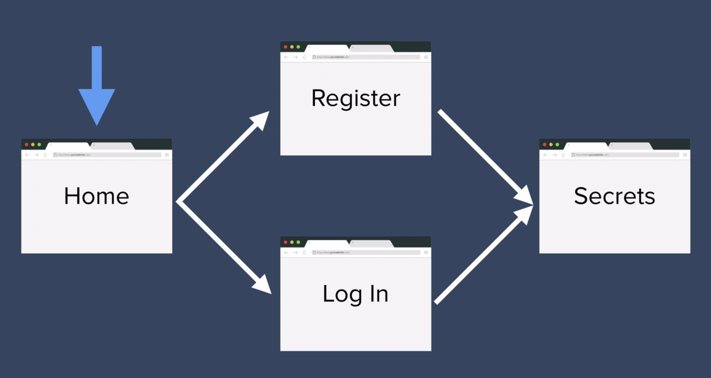
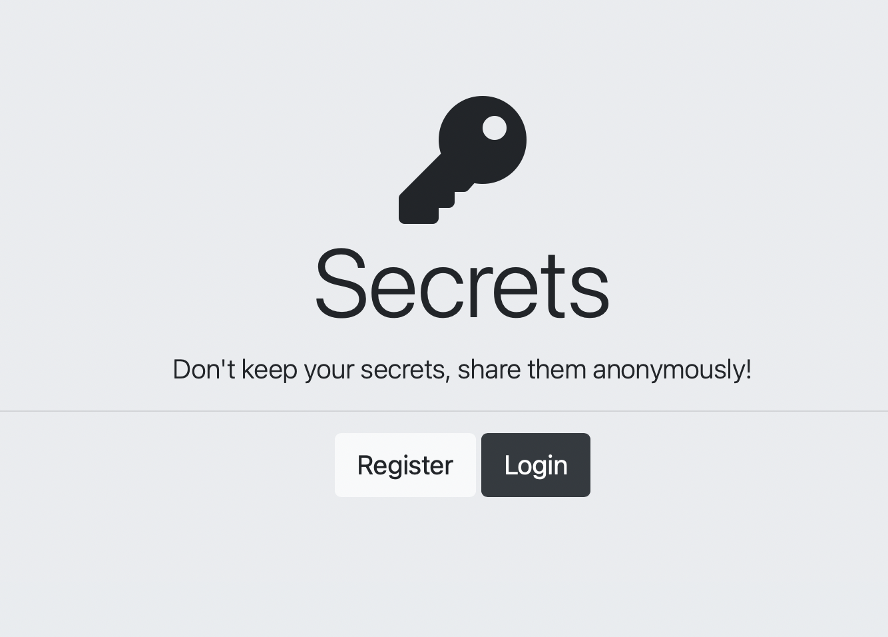
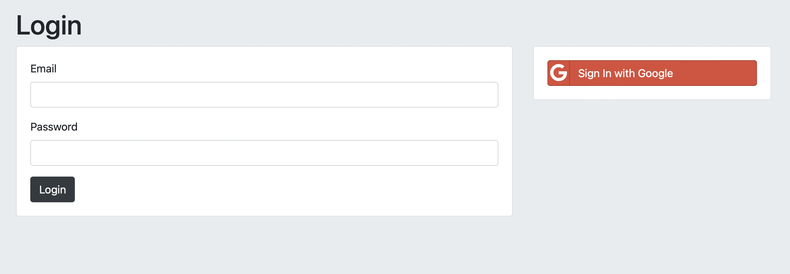

# Authentication-Security

Creating a web application in implementing authentication (accounts) & security to access Secret page, similar to the Whisper Application. Users are able to register, login, and able to access the secret page, as well as, add their own secret. 

This project contains 5 same mini-projects each using different level or strength of authentication security.

**Simple Wireframe**

1) Secret String Encryption (mongoose-encryption) --> weakest Security 
2) MD5 Hash Encryption 
3) Salt & Hashing Encryption (bcrypt)
4) Salt & Hashing Encryption (passport/cookies) 
5) Google OAuth 2.0 --> Strongest Security 

**Instructions**

-Need to install node modules or packages or dependencies in each project first before running --> npm install 

-Need to install local MongoDB (All projects uses MongoDB) 

**Sample Interface**

